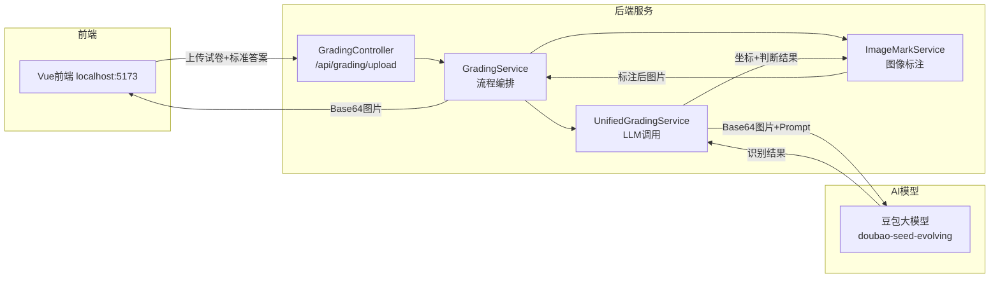
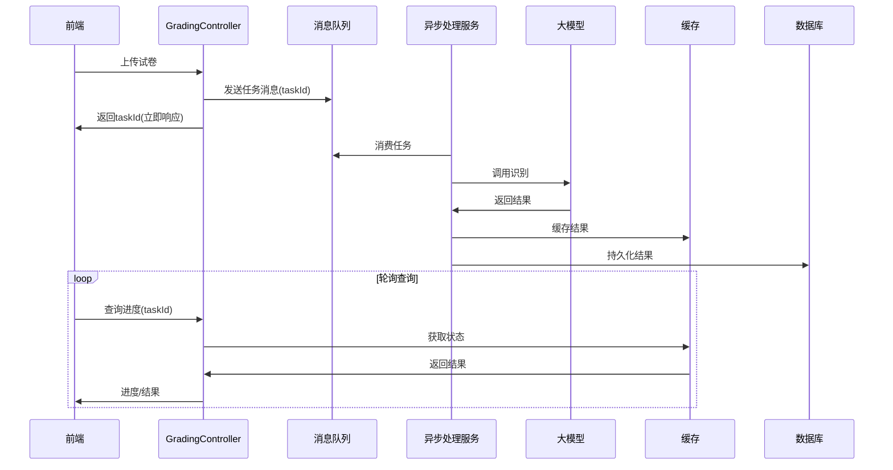
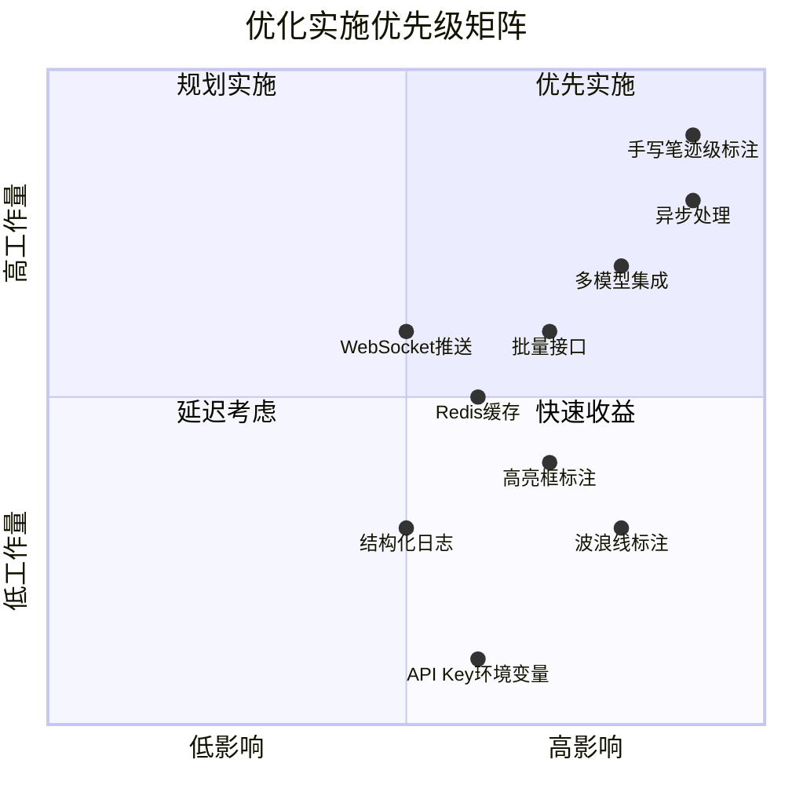

# 智能阅卷系统 - 优化设计技术文档

> 文档版本: v1.0  
> 生成日期: 2026-07-01  
> 适用范围: 后端服务优化设计

---

## 目录

1. [背景与现状分析](#1-背景与现状分析)
2. [错误题目自动画线标注优化](#2-错误题目自动画线标注优化)
3. [其他优化建议](#3-其他优化建议)
4. [实施优先级建议](#4-实施优先级建议)

---

## 1. 背景与现状分析

### 1.1 当前系统架构



### 1.2 当前图像标注能力

当前 `ImageMarkService.java` 已实现的标注功能：

| 功能 | 状态 | 实现位置 |
|------|------|----------|
| 正确答案标注 √ | 已实现 | `drawMark()` 第189-206行 |
| 错误答案标注 × | 已实现 | `drawMark()` 第189-206行 |
| 错误下划线 | 已实现 | `drawUnderline()` 第208-213行 |
| 解析文字绘制 | 已实现 | `drawUnifiedAnnotations()` 第101-155行 |
| 文本自动换行 | 已实现 | `wrapText()` 第160-187行 |

### 1.3 当前存在的不足

1. **画线标注样式单一**：仅支持简单的水平下划线，缺乏更醒目的错误标记方式
2. **错误标记可视化程度不足**：缺少波浪线、删除线、高亮框等多样化标注样式
3. **坐标系统依赖性强**：完全依赖LLM返回的边界框，未做冗余校验
4. **缺少错题汇总视图**：无法在单张图片上展示整体得分和错题统计
5. **图像处理性能**：使用AWT处理大图时内存占用较高
6. **并发处理能力**：未做异步化处理，大模型调用阻塞主线程

---

## 2. 错误题目自动画线标注优化

### 2.1 优化目标

提升错误题目标注的**视觉醒目度**和**信息表达能力**，实现以下效果：

- 多样化错误标记样式（波浪线、删除线、高亮框）
- 错误区域高亮填充
- 错题编号自动标注
- 支持手写笔迹级别的精细标注

### 2.2 详细设计方案

#### 2.2.1 增强型画线标注模块

**位置**: 扩展 `ImageMarkService.java`

```java
// 新增标注样式枚举
public enum MarkStyle {
    UNDERLINE,      // 下划线（现有）
    WAVY_LINE,      // 波浪线（新增）
    STRIKETHROUGH,  // 删除线（新增）
    HIGHLIGHT_BOX,  // 高亮框（新增）
    CIRCLE_MARK,    // 红圈标记（新增）
    CORRECT_MARK    // 正确答案覆盖（新增）
}
```

**新增标注方法**：

| 方法名 | 功能描述 | 实现思路 |
|--------|----------|----------|
| `drawWavyLine()` | 绘制红色波浪线 | 使用正弦函数计算波浪路径，`Graphics2D.draw()`绘制 |
| `drawStrikethrough()` | 绘制删除线 | 在答案区域中间绘制斜线或横线 |
| `drawHighlightBox()` | 绘制半透明高亮框 | 使用 `AlphaComposite` 实现半透明红色填充 |
| `drawCircleMark()` | 绘制红圈标记 | 使用 `drawOval()` 绘制椭圆圈住错误答案 |
| `drawCorrectAnswer()` | 在错误答案旁标注正确答案 | 使用不同颜色字体标注正确答案 |

**波浪线绘制算法示例**：

```java
private void drawWavyLine(Graphics2D g, Rectangle bounds) {
    g.setColor(new Color(220, 38, 38));
    g.setStroke(new BasicStroke(2));
    
    int startX = bounds.x;
    int endX = bounds.x + bounds.width;
    int baseY = bounds.y + bounds.height + 8;
    
    // 波浪线参数
    int amplitude = 3;  // 振幅
    int wavelength = 8; // 波长
    
    Path2D.Double wave = new Path2D.Double();
    wave.moveTo(startX, baseY);
    
    for (int x = startX; x <= endX; x++) {
        int y = baseY + (int)(amplitude * Math.sin((x - startX) * 2 * Math.PI / wavelength));
        wave.lineTo(x, y);
    }
    
    g.draw(wave);
}
```

#### 2.2.2 数据模型扩展

**位置**: `UnifiedGradingResult.java`

扩展现有模型以支持标注样式选择和精细坐标：

```java
@Data
public static class QuestionResult {
    // 现有字段
    private String studentAnswer;
    private String result;
    private String explanation;
    private String errorAnalysis;
    private BoundingBox bbox;
    
    // 新增字段
    private String correctAnswer;       // 正确答案文本
    private MarkStyle markStyle;        // 标注样式选择
    private List<StrokeBox> strokes;    // 手写笔迹级坐标
    private int questionNumber;         // 题号
    private float confidence;           // 识别置信度
}

@Data
public static class StrokeBox {
    private int x, y, width, height;    // 单个字迹框
    private String character;           // 该字迹对应的字符
    private boolean isCorrect;          // 该字迹是否正确
}
```

#### 2.2.3 Prompt优化方案

**位置**: `UnifiedGradingService.java` 第30-54行

优化Prompt以获取更多标注所需信息：

```java
String enhancedPrompt = String.format(
    "你是一位严谨的试卷批改老师。请分析这张试卷图片，完成以下任务：\n\n" +
    "1. 识别出学生所有手写答案的位置，用边界框标出每个答案区域（坐标请返回像素值）。\n" +
    "2. 识别每个答案区域内的手写文字内容。\n" +
    "3. 对每个答案中的每个字迹/字符，提供精细的边界框坐标。\n" +
    "4. 将识别出的学生答案与标准答案进行比对。标准答案如下：\n%s\n\n" +
    "5. 对每个答案判断对错，并给出详细的解析和错因（如果错误的话）。\n" +
    "6. 标注每个答案的题号。\n\n" +
    "请严格按照以下JSON格式返回结果：\n" +
    "{\n" +
    "  \"questions\": [\n" +
    "    {\n" +
    "      \"questionNumber\": 题号,\n" +
    "      \"studentAnswer\": \"学生答案\",\n" +
    "      \"correctAnswer\": \"正确答案\",\n" +
    "      \"result\": \"正确\"或\"错误\",\n" +
    "      \"explanation\": \"解析\",\n" +
    "      \"errorAnalysis\": \"错因分析\",\n" +
    "      \"confidence\": 0.95,\n" +
    "      \"bbox\": {\"x\":0, \"y\":0, \"width\":100, \"height\":30},\n" +
    "      \"strokes\": [\n" +
    "        {\"character\":\"字\", \"isCorrect\":false, \"bbox\":{...}}\n" +
    "      ],\n" +
    "      \"suggestedMarkStyle\": \"WAVY_LINE\"\n" +
    "    }\n" +
    "  ]\n" +
    "}"
);
```

#### 2.2.4 标注样式自动选择策略

```java
public class MarkStyleSelector {
    
    public MarkStyle selectStyle(QuestionResult question) {
        // 策略1: 根据LLM建议
        if (question.getSuggestedMarkStyle() != null) {
            return question.getSuggestedMarkStyle();
        }
        
        // 策略2: 根据错误类型选择
        if (question.getErrorAnalysis().contains("漏写") || 
            question.getErrorAnalysis().contains("空")) {
            return MarkStyle.CIRCLE_MARK;  // 漏写用红圈标注
        }
        
        if (question.getErrorAnalysis().contains("计算")) {
            return MarkStyle.HIGHLIGHT_BOX; // 计算错误高亮
        }
        
        // 策略3: 默认波浪线
        return MarkStyle.WAVY_LINE;
    }
}
```

### 2.3 效果对比

| 标注类型 | 当前效果 | 优化后效果 | 适用场景 |
|----------|----------|------------|----------|
| 基础下划线 | 简单红线 | 保留作为轻量标记 | 简单错误 |
| 波浪线 | 无 | 红色波浪下划线 | 语法/书写错误 |
| 高亮框 | 无 | 半透明红色背景填充 | 严重错误/计算错误 |
| 删除线 | 无 | 中间划线 | 多余答案 |
| 红圈标记 | 无 | 红色椭圆圈住答案 | 漏答/空白 |
| 正确标注 | 无 | 在错误旁标注正确答案 | 填空/选择 |

---

## 3. 其他优化建议

### 3.1 系统架构优化

#### 3.1.1 异步处理流程

**问题**：当前大模型调用是同步阻塞的，处理时间较长

**优化方案**：



#### 3.1.2 引入Redis缓存

**新增配置** (`application.yml`)：

```yaml
spring:
  data:
    redis:
      host: localhost
      port: 6379
      database: 0
```

**缓存策略**：
- 相同试卷图片的MD5值作为Key
- 缓存时间：7天
- 减少重复调用大模型API

### 3.2 图像处理优化

#### 3.2.1 图片预处理

在 `ImageMarkService` 中增加预处理步骤：

```java
public byte[] markImageWithUnifiedResult(MultipartFile file, UnifiedGradingResult result) {
    // 1. 图片预处理
    BufferedImage processed = preprocessImage(file);
    
    // 2. 现有标注逻辑
    // ...
}

private BufferedImage preprocessImage(BufferedImage source) {
    // 自动旋转校正
    // 对比度增强
    // 噪点去除
    // 尺寸归一化(最大边不超过2048像素)
}
```

#### 3.2.2 图像流式处理

对于大图片，使用流式处理避免内存溢出：

```java
// 使用JavaCV进行流式处理
public void processLargeImage(InputStream input, OutputStream output) {
    FFmpegFrameGrabber grabber = new FFmpegFrameGrabber(input);
    // 分块处理大图
}
```

### 3.3 API接口优化

#### 3.3.1 批量阅卷接口

**位置**: `GradingController.java`

新增批量处理端点：

```java
@PostMapping("/upload/batch")
public BatchGradeResponse gradeBatch(@RequestBody List<GradeRequest> requests) {
    // 批量处理多张试卷
    // 使用CompletableFuture并行处理
}
```

#### 3.3.2 WebSocket实时推送

```java
@ServerEndpoint("/ws/grading/{taskId}")
public class GradingWebSocket {
    // 实时推送阅卷进度
    // 减少前端轮询
}
```

### 3.4 模型层优化

#### 3.4.1 多模型集成

**配置文件** (`application.yml`)：

```yaml
ai:
  llm:
    primary:
      provider: doubao
      model: doubao-seed-evolving
    fallback:
      provider: qwen
      model: qwen-plus
```

实现模型失败自动降级：

```java
@Service
public class MultiLlmService {
    
    public UnifiedGradingResult gradeWithFallback(MultipartFile file, String answer) {
        try {
            return primaryModel.grade(file, answer);
        } catch (Exception e) {
            log.warn("主模型失败，切换到备用模型");
            return fallbackModel.grade(file, answer);
        }
    }
}
```

#### 3.4.2 结果校验与修正

```java
@Component
public class ResultValidator {
    
    public ValidationResult validate(UnifiedGradingResult result) {
        // 检查坐标是否超出图片范围
        // 检查题目数量是否符合预期
        // 检查置信度阈值
        // 返回校验报告
    }
}
```

### 3.5 可观测性优化

#### 3.5.1 结构化日志

增强 `logback.xml` 配置：

```xml
<encoder>
    <pattern>{
        "timestamp": "%d{ISO8601}",
        "level": "%level",
        "traceId": "%X{traceId}",
        "service": "smart-grading",
        "class": "%logger{36}",
        "message": "%msg"
    }%n</pattern>
</encoder>
```

#### 3.5.2 性能指标采集

```java
@Component
public class GradingMetrics {
    
    private final MeterRegistry registry;
    
    // 记录API调用耗时
    public void recordGradingDuration(long millis) {
        registry.timer("grading.duration").record(millis, TimeUnit.MILLISECONDS);
    }
    
    // 记录模型调用次数
    public void incrementModelCall(String model) {
        registry.counter("model.calls", "provider", model).increment();
    }
}
```

### 3.6 安全性优化

#### 3.6.1 API Key管理

**位置**: `application.yml`

当前配置：
```yaml
ai:
  llm:
    api-key: "ark-4ef84834-d169-4130-b86f-cc45e081061e-0b95f"  # 硬编码，不安全
```

优化方案：

```yaml
ai:
  llm:
    api-key: ${LLM_API_KEY}  # 从环境变量读取
```

#### 3.6.2 图片安全检查

```java
@Component
public class ImageSecurityChecker {
    
    public void check(MultipartFile file) throws SecurityException {
        // 检查文件类型(只允许jpg/png)
        // 检查文件大小
        // 检查图片内容(敏感内容检测)
    }
}
```

### 3.7 前端展示优化建议

虽然本文档主要关注后端，但建议前端配合优化：

1. **交互式标注展示**：鼠标悬停显示详细解析
2. **分层显示**：支持开关不同标注层(对号/叉号/解析)
3. **缩放浏览**：支持图片放大查看细节标注
4. **错题本生成**：自动汇总所有错题生成PDF

---

## 4. 实施优先级建议

### 4.1 优先级矩阵



### 4.2 阶段规划

#### 第一阶段：核心功能增强（1-2周）

- [ ] 实现波浪线、高亮框等多样化标注样式
- [ ] 扩展 `UnifiedGradingResult` 模型支持新字段
- [ ] 优化Prompt以获取更多标注信息
- [ ] API Key改为环境变量配置

#### 第二阶段：性能优化（2-3周）

- [ ] 引入Redis缓存
- [ ] 实现异步处理流程
- [ ] 图片预处理优化
- [ ] 结构化日志和监控

#### 第三阶段：架构升级（3-4周）

- [ ] 批量阅卷接口
- [ ] 多模型集成与降级
- [ ] WebSocket实时推送
- [ ] 结果校验与修正机制

### 4.3 技术选型建议

| 优化项 | 推荐方案 | 备选方案 |
|--------|----------|----------|
| 消息队列 | RabbitMQ | Kafka / RocketMQ |
| 缓存 | Redis | Caffeine(本地) |
| 图片处理 | JavaCV | Thumbnailator |
| 监控 | Micrometer + Prometheus | Spring Boot Actuator |

---

## 附录

### A. 当前关键代码位置汇总

| 文件 | 路径 | 行数 | 功能 |
|------|------|------|------|
| 图像标注服务 | `service/ImageMarkService.java` | 215 | 核心标注逻辑 |
| LLM调用服务 | `service/UnifiedGradingService.java` | 174 | 大模型交互 |
| 主阅卷服务 | `service/GradingService.java` | 58 | 流程编排 |
| 数据模型 | `model/UnifiedGradingResult.java` | 27 | 结果数据结构 |
| 控制器 | `controller/GradingController.java` | 21 | API接口 |
| 配置文件 | `resources/application.yml` | 31 | 系统配置 |

### B. 标注样式参考图

```
┌─────────────────────────────────────────┐
│  答案A  ~~~~~~~~~~~~~~~~~~~~~~~~~~~~~~~~│  ← 波浪线 (WAVY_LINE)
│  答案B  ▒▒▒▒▒▒▒▒▒▒▒▒▒▒▒▒▒▒▒▒▒▒▒▒▒▒▒▒▒ │  ← 高亮框 (HIGHLIGHT_BOX)
│  答案C  ────────────────────────────────│  ← 删除线 (STRIKETHROUGH)
│  答案D         ( 答案D )                │  ← 红圈标记 (CIRCLE_MARK)
│  答案E  _________ 正确答案: 答案F        │  ← 正确标注 (CORRECT_MARK)
└─────────────────────────────────────────┘
```

---

*本文档仅作为优化设计参考，不改变现有代码结构。*
